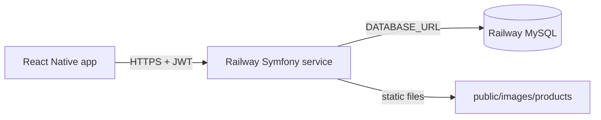

# Deploying RAIN Symfony API to Railway

This guide configures the backend for **production** on [Railway](https://railway.com), with **MySQL**, **JWT**, **migrations**, and **React Native** compatibility.

## Architecture



- **Real-time sync**: Symfony now broadcasts live events through a dedicated WebSocket hub service (`realtime-ws`) for dashboard and mobile notifications.
- **Product images**: Served from `public/images/products/` at `/images/products/{filename}`. `imageUrl` in JSON uses `APP_URL`.

## 1. Create Railway project

1. New project → **Deploy from GitHub** (this repository).
2. Add **MySQL** database service.
3. In the **Symfony service** → **Variables**, add the variables below.

## 2. Required environment variables

| Variable | Description |
|----------|-------------|
| `APP_ENV` | `prod` |
| `APP_DEBUG` | `0` |
| `APP_SECRET` | Random string (e.g. `php -r "echo bin2hex(random_bytes(16));"`) |
| `DATABASE_URL` | **Required on the web service.** Variables → **Add Reference** → choose your **MySQL** service → **`MYSQL_URL`** (private network). Do **not** use `127.0.0.1` or the Dockerfile build placeholder. |
| `APP_URL` | Public HTTPS URL of the app, e.g. `https://rain-api-production.up.railway.app` (no trailing slash) |
| `DEFAULT_URI` | Same as `APP_URL` |
| `JWT_PASSPHRASE` | Long random secret (used when generating PEM keys) |
| `CORS_ALLOW_ORIGIN` | `^https?://.*` (or restrict to your domains) |
| `MESSENGER_TRANSPORT_DSN` | Optional — defaults to `doctrine://default?queue_name=messages` (uses MySQL) |
| `MAILER_DSN` | Optional — defaults to `null://null` (email disabled unless you configure Brevo/SMTP) |
| `REALTIME_WS_BROADCAST_URL` | Internal broadcast endpoint used by Symfony, e.g. `http://realtime-ws:8090/broadcast` |
| `REALTIME_WS_BROADCAST_KEY` | Shared secret between Symfony and the WebSocket hub |
| `REALTIME_WS_PUBLIC_URL` | Public/client WebSocket URL, e.g. `wss://your-ws-service.up.railway.app` |

### JWT keys (choose one approach)

**A — Recommended (stable across redeploys)**  
Generate once locally, then store as Railway variables:

```bash
php bin/console lexik:jwt:generate-keypair
# Linux / macOS / Git Bash on Windows:
export JWT_PRIVATE_KEY_B64=$(base64 -w0 config/jwt/private.pem)
export JWT_PUBLIC_KEY_B64=$(base64 -w0 config/jwt/public.pem)
```

Add `JWT_PRIVATE_KEY_B64` and `JWT_PUBLIC_KEY_B64` in Railway (paste the base64 strings). Keep `JWT_PASSPHRASE` the same value used when generating the keys.

**B — Auto-generate on build**  
Set only `JWT_PASSPHRASE`. Keys are created during `bin/railway-build.sh`. **Redeploys regenerate keys** and invalidate existing mobile tokens until users log in again.

## 3. Build and start commands

Configured in `Dockerfile` + `railway.toml`:

| Phase | What runs |
|-------|-----------|
| Build | `Dockerfile` → `bin/railway-build.sh` (Composer + Symfony cache) |
| Start | `entrypoint.sh` (migrations + Nginx + PHP-FPM on `$PORT`) |

If a deploy log shows `composer: command not found` with `--ignore-platform-reqs`, Railway used the wrong auto-builder — ensure `Dockerfile` is committed and `railway.toml` sets `builder = "DOCKERFILE"`.

Do **not** set a custom Railway **Start Command** to `php -S` — that conflicts with the Dockerfile (Nginx must listen on `$PORT`). The entrypoint runs migrations, warms cache, then Nginx + PHP-FPM.

## 3.1 Realtime WebSocket service (second Railway service)

Deploy `realtime-ws/` as a separate Node.js Railway service:

1. Add a new Railway service from the same repo, root directory `realtime-ws/`.
2. Set `REALTIME_WS_BROADCAST_KEY` on both services (same exact value).
3. Set WebSocket service `PORT` to Railway `$PORT` (Railway injects this automatically).
4. In Symfony service variables:
   - `REALTIME_WS_BROADCAST_URL=http://<realtime-private-host>/broadcast`
   - `REALTIME_WS_PUBLIC_URL=wss://<realtime-public-domain>`
5. Redeploy both services.

## 4. Networking

- Generate a **public domain** for the Symfony service (Railway → Settings → Networking).
- Set `APP_URL` and `DEFAULT_URI` to that `https://…` URL.
- Health check: `GET /health` (no database). Catalog: `GET /api/products`.

## 5. Seed data (first deploy)

Run once from Railway **Shell** or locally with production `DATABASE_URL`:

```bash
php bin/console doctrine:fixtures:load --no-interaction --env=prod
```

Test customer (after fixtures): `john.doe@example.com` / `customer123`

Verify API:

```bash
php bin/console app:api:verify-customer --base-url=https://YOUR_APP.up.railway.app
```

## 6. React Native app

In your Expo app (see `app-integration/react-native/`):

```env
EXPO_PUBLIC_API_URL=https://YOUR_APP.up.railway.app
```

Rebuild or restart Expo after changing the URL. Login: `POST /api/login` with `{ "email", "password" }`; use the returned `token` as `Authorization: Bearer …`.

## 7. Product image uploads (persistence)

Railway containers use an **ephemeral filesystem**. Files under `public/images/products/` are **lost on redeploy** unless you:

- Attach a **Railway Volume** mounted at `/app/public/images/products` (and optionally `/app/public/uploads`), or
- Move to object storage (S3, etc.) in a future iteration.

For demos, re-upload images after redeploy or use fixtures with bundled `public/image/` assets.

## 8. API endpoints (mobile)

| Endpoint | Auth |
|----------|------|
| `GET /api/products` | Public |
| `POST /api/login` | Public |
| `GET/POST /api/cart`, `/api/cart/items` | JWT (`ROLE_USER`) |
| `POST /api/orders`, `/api/payments` | JWT |
| `GET/PUT /api/customer/profile` | JWT |

Full reference: [API_CUSTOMER.md](./API_CUSTOMER.md)

## 9. Troubleshooting

| Symptom | Fix |
|---------|-----|
| **`Connection refused` on migrations** | `DATABASE_URL` missing or pointing at `127.0.0.1`. See below. |
| 401 on cart/orders | Log in again; check `JWT_*` keys and `JWT_PASSPHRASE` unchanged across deploys |
| Wrong `imageUrl` | Set `APP_URL` to the public HTTPS domain |
| 500 on startup | Check `DATABASE_URL`, MySQL service running, migrations in deploy logs |
| CORS in browser | Adjust `CORS_ALLOW_ORIGIN` |
| Build fails on JWT | Set `JWT_PASSPHRASE` or `JWT_*_B64` before build |

### `SQLSTATE[HY000] [2002] Connection refused`

The **web** service cannot reach MySQL. Fix in Railway (not in code):

1. Open your **Symfony / web** service (not the MySQL service).
2. Go to **Variables**.
3. Add or edit **`DATABASE_URL`**:
   - Click **+ New Variable** → **Add Reference**
   - Select your **MySQL** service
   - Choose **`MYSQL_URL`** (private URL, host like `*.railway.internal`)
4. **Do not** set `DATABASE_URL` to `127.0.0.1` or paste only `MYSQL_PUBLIC_URL` unless you know you need external access.
5. If `MYSQL_URL` has no `?serverVersion=…`, append: `?serverVersion=8.0.31&charset=utf8mb4` (use `&` if the URL already has `?`).
6. **Redeploy** the web service.

In deploy logs you should see: `Running database migrations (host: …railway.internal…)` — not `127.0.0.1`.

## 10. Local parity

Copy `.env.dist` to `.env.local` and adjust for development. Production on Railway does **not** require a committed `.env` file.
